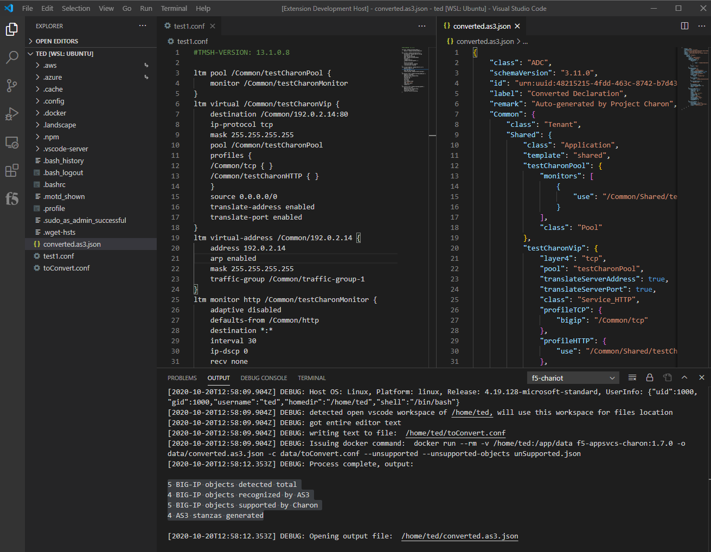
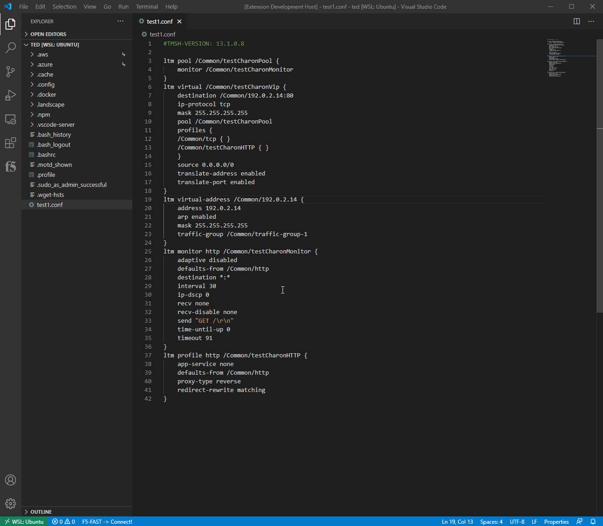

# vscode-f5-chariot

This is an integration with ACC(Charon) to provide quick conversions within vscode.

This extension requires that ACC already be installed and accessable via the command line

The .vsix to install this can be found in the releases section.

Please open an issue with any comments, questions, enhancements, or bugs.

Thanks!

&nbsp;

---

## Other Pages

* [CHANGELOG](CHANGELOG.md)

---

&nbsp;

## Architecture

This extension relys on docker being installed locally.  It takes text from an editor window, saves it to a .conf file and executes the ACC docker container pointing to that .conf file as an input.  Once processing has completed, the extension will open the output created by ACC.  

Docker integration is done with regular bash/exec commands provided through node

&nbsp;

> NOTE:  Going to see about getting ACC wrapped in a basic REST API and simple web page so it can be run as a service and interacted with over HTTP

&nbsp;

---

&nbsp;

## Extension Commands

This extension provides the following commands and are active on first command execute (if extension is installed and enabled). So it will take a couple of seconds to load the extension the first time a command is run

* `F5: Chariot Convert`: (via editor right-click) Converts entire editor text or selection with ACC
* `F5: Chariot Settings`: (via command palette 'F1') Quickly access settings for extension
* `F5: Chariot Image`: (pending) Provides list of locally available docker images for the user to select which image to use for processing

&nbsp;

---

&nbsp;

## Demo

The following shows a simple demo of the core goal of this project, which is take a tmos config and convert it to as3 within vscode so it can be deployed using the vscode-f5 extension features

&nbsp;

<!-- ; -->

&nbsp;

<!-- ; -->

&nbsp;

---

&nbsp;

## Debugging extension

* Clone repo
* Run `npm install` in terminal to install dependencies
* Run the `Run Extension` target in the Debug View. This will:
  * Start a task `npm: watch` to compile the code
  * Run the extension in a new VS Code window

## Copyright

Copyright 2014-2020 F5 Networks Inc.

### F5 Networks Contributor License Agreement

Before you start contributing to any project sponsored by F5 Networks, Inc. (F5) on GitHub, you will need to sign a Contributor License Agreement (CLA).  

If you are signing as an individual, we recommend that you talk to your employer (if applicable) before signing the CLA since some employment agreements may have restrictions on your contributions to other projects. Otherwise by submitting a CLA you represent that you are legally entitled to grant the licenses recited therein.  

If your employer has rights to intellectual property that you create, such as your contributions, you represent that you have received permission to make contributions on behalf of that employer, that your employer has waived such rights for your contributions, or that your employer has executed a separate CLA with F5.

If you are signing on behalf of a company, you represent that you are legally entitled to grant the license recited therein. You represent further that each employee of the entity that submits contributions is authorized to submit such contributions on behalf of the entity pursuant to the CLA.