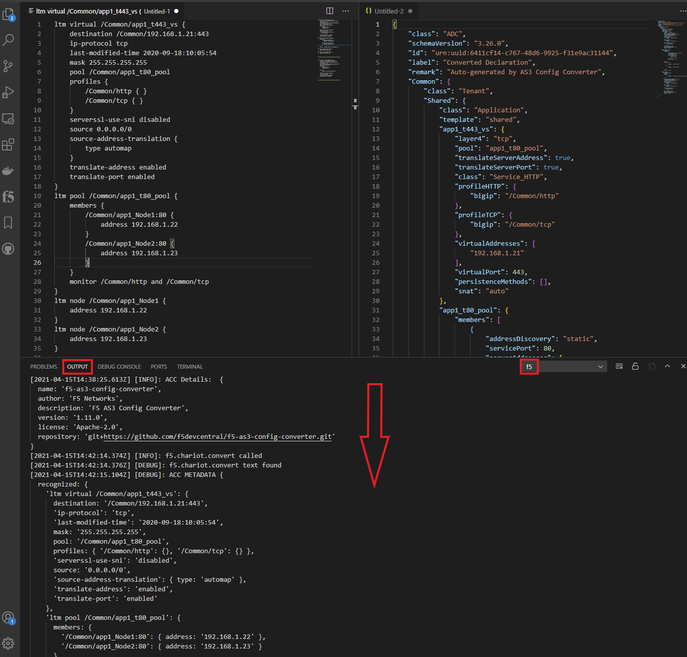
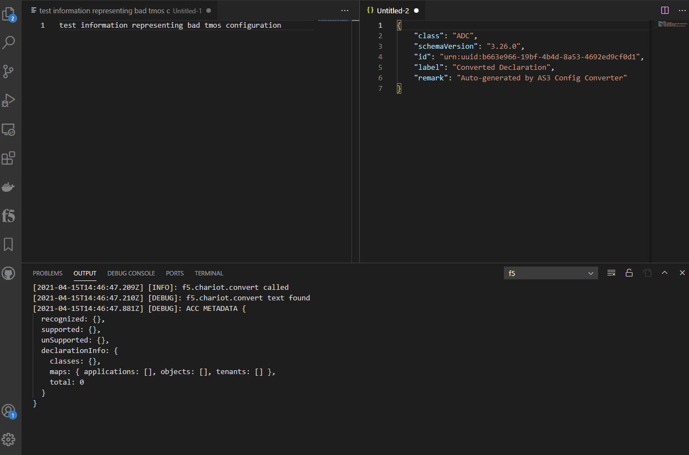

# vscode-f5-chariot

Greetings!

This is an integration with AS3-Configuration-Converter (ACC) to provide quick TMOS to AS3 conversions within vscode.

Install via the VSCode marketplace here:  <https://marketplace.visualstudio.com/items?itemName=F5DevCentral.vscode-f5-chariot>

This version of the extension has "batteries included" and does not require any external docker containers or dependencies.

The version of this extension is locked with the version of the ACC project.

It is recommended to utilize the output of the vscode-f5 config explorer output for conversions:

- <https://f5devcentral.github.io/vscode-f5/#/README>
- <https://f5devcentral.github.io/vscode-f5/#/config_explorer>
- <https://marketplace.visualstudio.com/items?itemName=F5DevCentral.vscode-f5>

Please open an issue with any comments, questions, enhancements, or bugs.

Thanks!

---

## Other Pages

### Main f5-as3-config-converter (ACC) Repo

* [Repo](https://github.com/f5devcentral/f5-as3-config-converter)
* [Issues](https://github.com/f5devcentral/f5-as3-config-converter/issues)
* [Releases](https://github.com/f5devcentral/f5-as3-config-converter/releases)

### Other pages from this repo

[vscode-f5-chariot CHANGELOG](CHANGELOG.md)

---

## Troubleshooting

The extension is a single command/function to convert configuration to AS3.  By default all the output provided by ACC is displayed in the ``f5`` view of the ``OUTPUT`` window

## Good Input

<!--  -->

&nbsp;

## Bad Input

<!--  -->

&nbsp;

---

## Extension Commands

This extension provides a single command:

* `F5: Convert with ACC`: (via editor right-click) Converts entire editor text or selection with ACC

&nbsp;

---

&nbsp;

## Debugging extension

* Clone repo
* Run `npm install` in terminal to install dependencies
* Run the `Run Extension` target in the Debug View. This will:
  * Start a task `npm: watch` to compile the code
  * Run the extension in a new VS Code window

## Copyright

Copyright 2014-2020 F5 Networks Inc.

### F5 Networks Contributor License Agreement

Before you start contributing to any project sponsored by F5 Networks, Inc. (F5) on GitHub, you will need to sign a Contributor License Agreement (CLA).  

If you are signing as an individual, we recommend that you talk to your employer (if applicable) before signing the CLA since some employment agreements may have restrictions on your contributions to other projects. Otherwise by submitting a CLA you represent that you are legally entitled to grant the licenses recited therein.  

If your employer has rights to intellectual property that you create, such as your contributions, you represent that you have received permission to make contributions on behalf of that employer, that your employer has waived such rights for your contributions, or that your employer has executed a separate CLA with F5.

If you are signing on behalf of a company, you represent that you are legally entitled to grant the license recited therein. You represent further that each employee of the entity that submits contributions is authorized to submit such contributions on behalf of the entity pursuant to the CLA.
